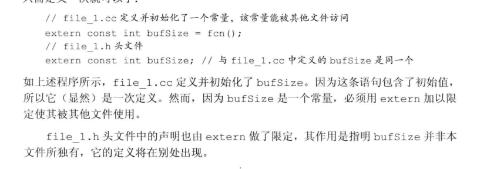
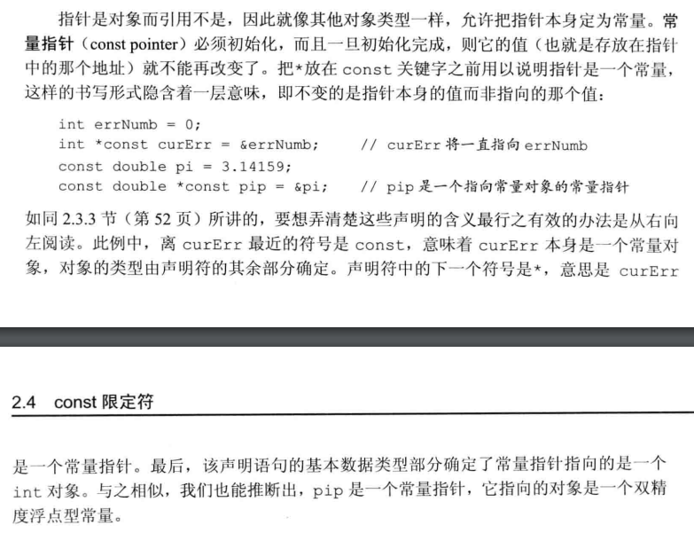
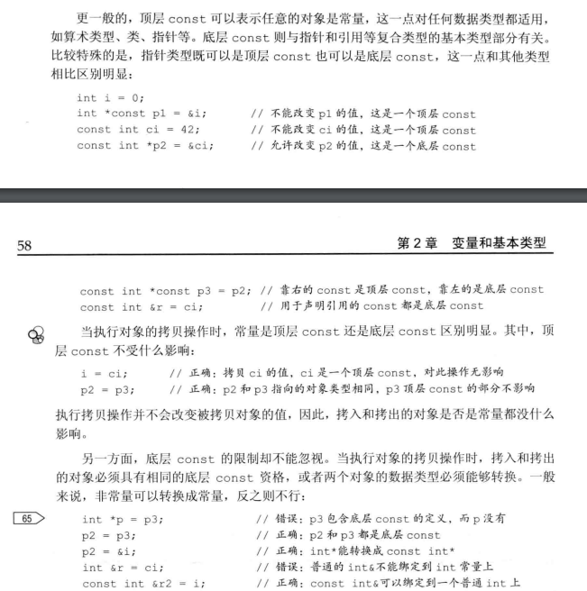
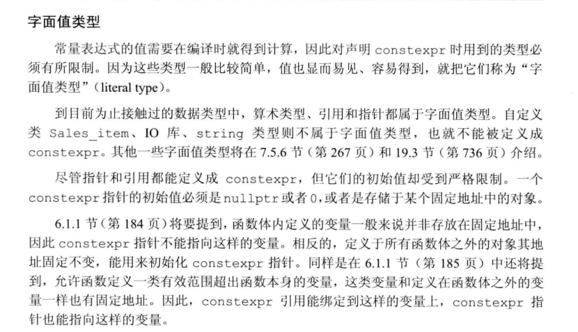
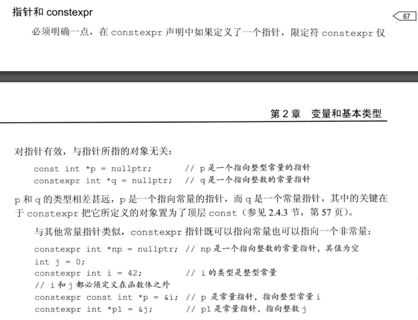
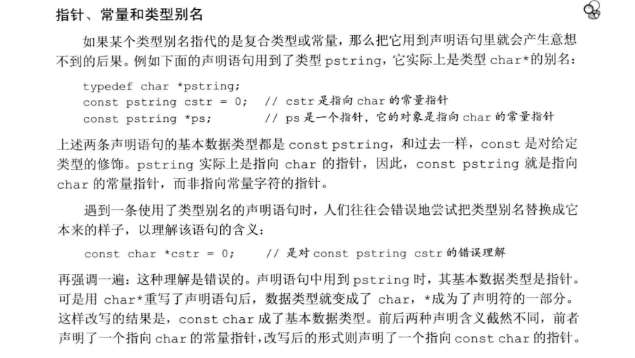

## 
### 指针
1. 共有三种形式的空指针定义：  
    - :int *var=nullptr;  
    - :int *var=NULL;  
    - :int *var=0; 
                                                                                                                                      
2. void*指针可以存储任意类型对象的地址  
                                                            
3. 复合类型的声明：  
&emsp;&emsp;一条定义语句可以定义出不同类型的变量，如：   
&emsp;&emsp;int var, *Ptr=&var, &pi=var (*与&是类型修饰符)  
                                                            
4. 对指针的引用：  
&emsp;&emsp;指针是一个内存对象，所以能够对其进行引用。示例如下：  
&emsp;&emsp;int var, *ptr;  
&emsp;&emsp;`int *&pi=ptr`;  
&emsp;&emsp;注：对一个指针引用来说，要理解其类型是什么，最简单的  方法就是从右向左读pi的定义。离变量最近的符号（&）对变量类型有最
直接的影响，因此pi是一个引用，其余部分则用来确认引用的类型是什么，此例中*表示引用的是一个指针，而int代表指针指向的对象是int类型。
  
### const限定符：  
1. 如果想要声明一个变量而不定义它（用于在改程序中使用别处文件中的变量），就在变量名字前添加关键字extern，且不要显式地初始化变量：如下：  
&emsp;&emsp;extern int i；  
默认情况下，const对象仅在当前文件下有效，因此别处文件要使用的话，则需要双方使用extern进行声明，如下：  
  
2. const的引用（对常量的引用）：    
&emsp;&emsp;const int var;  
&emsp;&emsp;const int &pi=var;  
&emsp;&emsp;注意以下的区别：  
&emsp;&emsp;指向常量的指针：  
&emsp;&emsp;const double var=3.14；    
&emsp;&emsp;const double *ptr=&var；（const位于最前面，*靠近ptr代表指针指向的对象是常量，而指针非常量）  
&emsp;&emsp;常量指针：  
&emsp;&emsp;double var=3.14；  
&emsp;&emsp;double *const ptr=&var；（const靠近ptr说明指针是常量，而指向的对象非常量）  
&emsp;&emsp;指向常量的常量指针：  
&emsp;&emsp;const double var=3.14；  
&emsp;&emsp;const double *const ptr=&var；  
&emsp;&emsp;详见下图：
 
3. 顶层const与底层const：  
&emsp;&emsp;顶层const：所声明对象本身是常量  
&emsp;&emsp;底层const：所声明对象的指向对象是常量  
&emsp;&emsp;拷贝区别：因为指针本身既是对象，又指向对象的特殊性，所以拷贝时有所要求：前提二者数据类型必须为指针，然后判断指针是否有限定符const修饰，若没有则可以正常拷贝；若有const修饰则判断是顶层const还是底层const。因为顶层const就代表指针本身是常量，而常量指针可以正常拷贝给非常量指针，因此顶层const对指针的拷贝没有影响。而底层const则是指指针所指向的对象为常量，底层const不能直接拷贝给一个指向非常量的指针；而对于一个指向非常量的指针拷贝给一个底层const，因为非常量可以转换为常量，反之不行，所以可以拷贝。相见下图：  

4. 常量表达式  
&emsp;&emsp;概念：值不会改变且在**编译过程**就能得到结果。  
&emsp;&emsp;const int i=getsize（）并不属于常量表达式，因为普通函
数是在运行阶段得出结果。(注：新标准允许定义一种足够简单的constexpr函数使得在编译阶段就能够得出结果)  
&emsp;&emsp;可以添加关键字constexpr声明变量，改变量需要使用常量表达式来初始化。如：  
&emsp;&emsp;constexpr int i=10；  
&emsp;&emsp;下面介绍字面值类型：

  

### 处理类型
1. 类型别名  
使用关键字typedef定义类型别名，也可使用using定义类型别名，如下所示：  
&emsp;&emsp;typedef double wages;  
&emsp;&emsp;`typedef wages base,*p；`（base是double的类型别名，p是double*的类型别名）  
&emsp;&emsp;using SI=Sales_Item; (SI是Sales_Item的类型别名)  
&emsp;&emsp;注意：

2. auto与decltype类型说明符  
&emsp;&emsp;使用auto关键字可以使得编译器根据初始值来推断表达式值的类型。如下：  
&emsp;&emsp;auto sum=var1+var2；  
&emsp;&emsp;auto i=0，*p=&i；（同时声明多个变量时，一条语句只能有一个**基本数据类型**，所以这些初始值类型应相同。*与&只从属于某个声明符，因此并不属于基本数据类型）

&emsp;&emsp;而与auto说明符不同的是，decltype说明符。decltype仅获得表达式的类型，舍弃其值。如下：
&emsp;&emsp;decltype（f()）var=x;

### 自定义数据结构
1. 头文件一旦改变，相关源文件必须重新编译以获得新的声明。  
&emsp;&emsp;使用条件编译来防止重复包含。

2. C++类型包含基础类型、复合类型（指针与引用）、自定义类型

  

